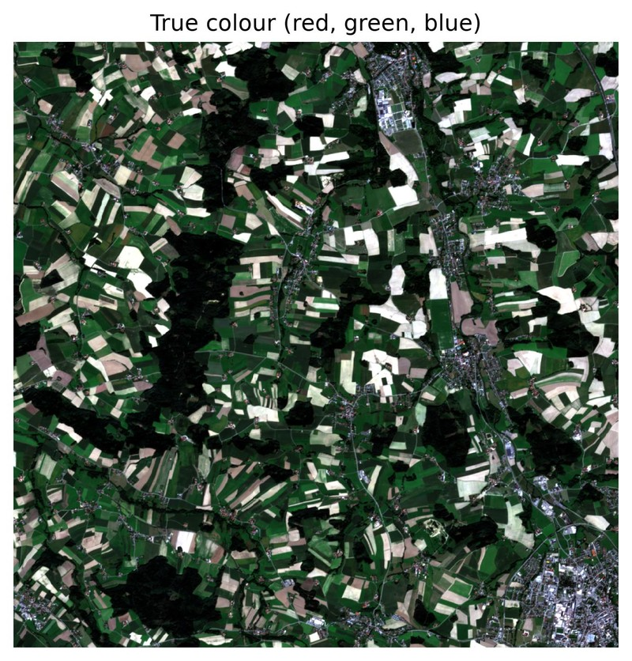
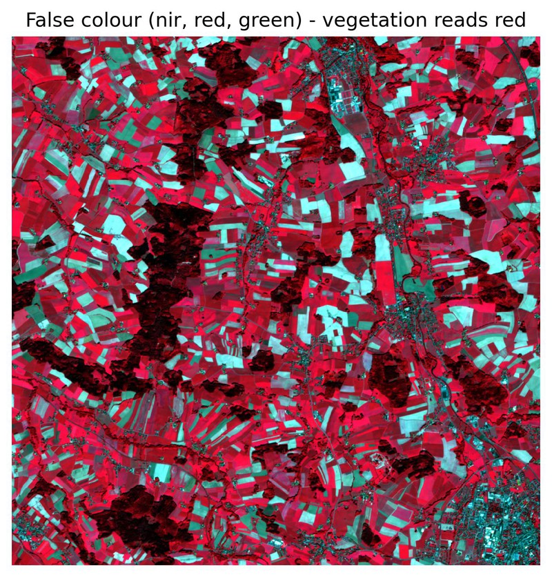
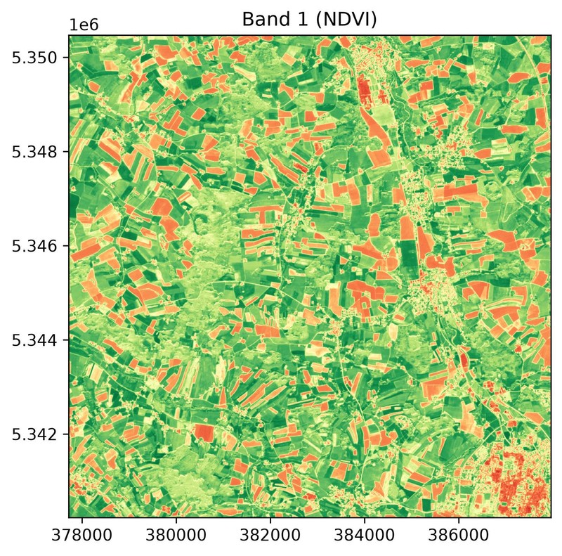
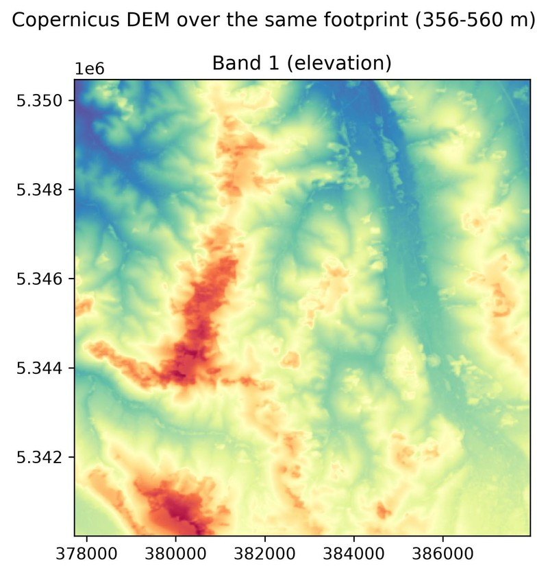
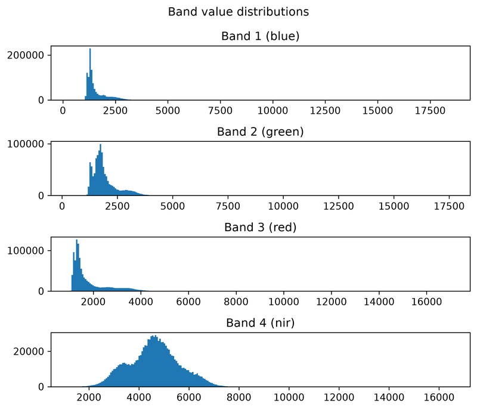
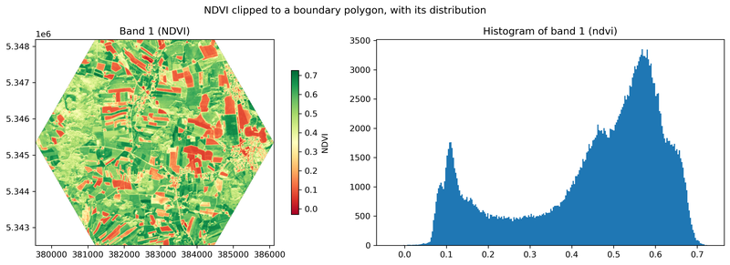

# Easy-EO

<p align="center">
  
</p>

[](https://github.com/Tommy-Burns/easy-eo/actions/workflows/ci.yml)
[](https://codecov.io/gh/Tommy-Burns/easy-eo)
[](https://pypi.org/project/easy-eo/)
[](https://pypi.org/project/easy-eo/)
[](https://easy-eo.readthedocs.io/en/latest/?badge=latest)
[](https://github.com/Tommy-Burns/easy-eo/blob/main/LICENSE)

Easy-EO is a lightweight, extensible Python library for raster-based Earth
Observation (EO) analysis: chainable raster processing, band algebra, spectral indices, 
and visualization, in a few readable lines instead of dealing with complex boilerplate code.

## From satellite archive to NDVI map

```python
import eeo

results = eeo.stac_search(
    "sentinel-2-l2a",
    bbox=(11.0, 46.5, 11.2, 46.7),        # area of interest, WGS 84 lon/lat
    datetime="2023-06-01/2023-08-31",
    cloud_cover=20,
    limit=1,
)
scene = results[0].load(["B04", "B08"])   # reads only the area of interest
ndvi = scene.ndvi(red="B04", nir="B08")
ndvi.plot_raster()
```

That is the whole workflow - no scene downloads, no GDAL wrangling. The search
queries [Microsoft Planetary Computer](https://planetarycomputer.microsoft.com/)
(any STAC catalog works, you have to pass `catalog="your stac catalog"`), and the load streams just the window covering your
bounding box over HTTP: 14 MB out of a 240 MB Sentinel-2 tile, in a few seconds.

The `stac_search` needs the STAC extra - `pip install "easy-eo[stac]"`. If you prefer to start offline, jump to the [hosted sample dataset](#quick-example), which needs no network after the first call.

---

## Features

| | What you get | Guide |
| --- | --- | --- |
| **Data access** | `stac_search()` over any STAC catalog, loading only your area of interest over HTTP; GeoTIFF/COG and anything else GDAL reads; a hosted sample dataset one call away | [Satellite data](https://easy-eo.readthedocs.io/en/latest/user_guide/loading_satellite_data.html) · [Sample data](https://easy-eo.readthedocs.io/en/latest/user_guide/sample_data.html) |
| **Spectral indices** | `ndvi`, `ndwi`, `ndmi`, `ndbi`, `evi`, `savi`, plus `normalized_difference` for anything else - all chainable and float32 | [Spectral indices](https://easy-eo.readthedocs.io/en/latest/user_guide/spectral_indices.html) |
| **Band algebra** | `add`, `subtract`, `multiply`, `divide`, `power`, `sqrt`, `log`, `absolute`, and the matching operators | [Operations](https://easy-eo.readthedocs.io/en/latest/user_guide/ops.html) |
| **Preprocessing** | Clip to a bounding box or a vector, resample, reproject, mosaic, stack, normalize (min-max, percentile, z-score) | [Preprocessing](https://easy-eo.readthedocs.io/en/latest/user_guide/preprocessing.html) |
| **Named bands** | Address any band as `"red"` or `"nir"` wherever a 1-based index works; names survive a GeoTIFF round-trip | [Naming bands](https://easy-eo.readthedocs.io/en/latest/user_guide/band_names.html) |
| **Statistics** | Per-band min/max/mean/percentile with their pixel locations, and value extraction at a coordinate | [Statistical locations](https://easy-eo.readthedocs.io/en/latest/user_guide/statistical_locations.html) |
| **Visualization** | Single bands, RGB composites, histograms, and map-plus-histogram views, read at display resolution | [Visualization](https://easy-eo.readthedocs.io/en/latest/user_guide/visualization.html) |
| **Predictable nodata & dtype** | One written-down contract every operation follows: mask before compute, nodata stays contagious, fractional results are float32 | [Nodata & dtype](https://easy-eo.readthedocs.io/en/latest/user_guide/nodata_and_dtype.html) |
| **Ecosystem interop** | `to_xarray()` / `from_xarray()` in both directions; NumPy and Rasterio backends behind one interface | [xarray interop](https://easy-eo.readthedocs.io/en/latest/user_guide/xarray_interop.html) · [Backends](https://easy-eo.readthedocs.io/en/latest/backends.html) |
| **Typed and tested** | Ships `py.typed`, 830+ tests, ~95% coverage, checked on Python 3.10-3.13 across Linux, macOS and Windows | [Contributing](CONTRIBUTING.md) |

---

## Before and after

One ordinary task: clip a 4-band scene to an area of interest held in a vector
file, compute NDVI, save it as a GeoTIFF. Both versions below run as written,
against the same [hosted sample dataset](https://easy-eo.readthedocs.io/en/latest/user_guide/sample_data.html)
- a 1024x1024 Sentinel-2 subset and a boundary polygon - so you can paste
either one and watch it work.

Here it is in raw Rasterio, GeoPandas and NumPy, with Easy-EO not installed at
all -

```python
import geopandas as gpd
import numpy as np
import rasterio
from rasterio.mask import mask

BASE = "https://github.com/Tommy-Burns/easy-eo/releases/download/sample-data-v1/"

with rasterio.open(BASE + "sentinel2_small_cog.tif") as src:
    aoi = gpd.read_file(BASE + "roi.gpkg").to_crs(src.crs)
    clipped, transform = mask(src, aoi.geometry.values, crop=True)
    bands = {name: i for i, name in enumerate(src.descriptions)}
    nodata = src.nodata
    profile = src.profile

red = clipped[bands["red"]].astype("float32")
nir = clipped[bands["nir"]].astype("float32")

valid = (red != nodata) & (nir != nodata)
total = nir + red
ndvi = np.where(valid & (total != 0), (nir - red) / np.where(total == 0, 1, total), 0.0)
ndvi = np.where(valid, ndvi, np.nan).astype("float32")

profile.update(
    count=1, dtype="float32", nodata=np.nan,
    height=ndvi.shape[0], width=ndvi.shape[1], transform=transform,
)
with rasterio.open("ndvi.tif", "w", **profile) as dst:
    dst.write(ndvi, 1)
```

-- and in Easy-EO, where `load_sample_dataset()` fetches the same two files and
caches them:

```python
import eeo
from eeo.datasets import load_sample_dataset

sd = load_sample_dataset()

(
    eeo.load_raster(sd.sentinel2_cog_stacked)
    .clip_raster_with_vector(sd.boundary)
    .ndvi(red="red", nir="nir")
    .save_raster("ndvi.tif")
)
```

Both blocks produce **byte-identical output** - same shape, CRS, transform,
nodata, and every one of the pixel values, including all pixels the clip
masks away (approx. a quarter of the image).
So the point is not the line count. It is that Rasterio makes you take four decisions by hand, 
each one a chance to be quietly wrong: reprojecting the AOI into the raster's CRS 
(the sample boundary is lon/lat, the scene is UTM), mapping band names to indices, 
masking nodata before the arithmetic, and rebuilding the output profile. Drop just the mask and NDVI comes out as `0.0` across the clipped-away quarter of the image - a value that looks like bare
ground in your statistics and your plot, not like missing data.

Easy-EO applies those same rules for you, consistently, on every operation. They
are written down in the [nodata and dtype contract](https://easy-eo.readthedocs.io/en/latest/user_guide/nodata_and_dtype.html)
and each one is backed by tests.

---

## What's next

Easy-EO is built around one scene at a time, and everything above works that
way today. These are the next capabilities, in the order they are being built:

| Coming | What it unlocks |
| --- | --- |
| **Block-wise execution** | Pixel-wise operations stream window by window instead of holding whole arrays, so a chain runs in a bounded memory footprint. Today, loading is read-free and clipping is windowed, but an operation like `ndvi()` materialises the bands it touches. |
| **Lazy backend** (`easy-eo[lazy]`) | An xarray/dask-backed adapter behind the existing interface: chains on rasters larger than RAM, and COGs read straight over HTTP, with no change to your code beyond the loader call. |
| **Time series** (`EEOTimeSeries`) | Multi-date stacks as a first-class object - map any existing operation across timesteps, reduce to cloud-free median composites, pull per-pixel trajectories. STAC search results are already ordered and timestamped, ready to become one. |
| **conda-forge packaging** | `conda install -c conda-forge easy-eo` alongside the current `pip install`. The recipe is submitted and under review. |
| **Citable releases** | A JOSS paper and Zenodo DOI, so the library can be cited in published work. |

**Already using xarray?** You do not have to choose. `to_xarray()` and `from_xarray()` convert in both directions, so you can clip and compute indices
here, hand the result to dask or anything else in the xarray ecosystem, and come back - which is also how to work past a single machine's memory today.
See the [xarray interop guide](https://easy-eo.readthedocs.io/en/latest/user_guide/xarray_interop.html).

---

## Installation

Python 3.10 or newer:

```bash
pip install easy-eo
```

That is everything you need for the core: raster I/O, algebra, indices,
preprocessing and plotting. Two optional extras add the heavier integrations,
and they compose (`pip install "easy-eo[stac,xarray]"`):

| Extra | Command | Adds |
| --- | --- | --- |
| `stac` | `pip install "easy-eo[stac]"` | `stac_search()` and loading scenes from STAC catalogs |
| `xarray` | `pip install "easy-eo[xarray]"` | `to_xarray()` / `from_xarray()` |

Without an extra installed, the features that need it raise a
`MissingDependencyError` telling you exactly what to install - nothing fails
silently at import time.

Prefer conda? Easy-EO's recipe is
[under review at conda-forge](https://github.com/conda-forge/staged-recipes),
so `conda install` is not available yet. Until it lands, pip installs cleanly
into a conda environment:

```bash
conda create -n eeo python=3.11
conda activate eeo
pip install easy-eo
```

## Quick Example
```python
from eeo import load_raster

ds_nir = load_raster("path/to/nir.tif")
ds_red = load_raster("path/to/red.tif")

# Chainable example: clip -> resample -> compute NDVI -> multiply
result = (
    ds_nir.clip_raster_with_bbox((0, 0, 1000, 1000))
    .resample(scale_factor=2)
    .normalized_difference(ds_red)
    .multiply(100)
)
```

***Or try with a hosted sample data***
```python
from eeo.datasets import load_sample_dataset
from eeo import load_raster

sd = load_sample_dataset()

scene = load_raster(sd.sentinel2_cog_stacked)  # red, green, blue, nir bands

ndvi = scene.ndvi(red="red", nir="nir")
ndvi.plot_raster()
```

## Tutorials

Sixteen runnable notebooks live in [`examples/`](examples/README.md), from first
install through to complete analyses (flood mapping, drought stress, land cover,
terrain). Each one opens in Colab with no local setup — the first cell installs
Easy-EO when it detects Colab:

| | |
| --- | --- |
| [Quickstart: NDVI](examples/00_getting_started/02_quickstart_ndvi.ipynb) — open a scene, compute an index, plot it | [](https://colab.research.google.com/github/Tommy-Burns/easy-eo/blob/main/examples/00_getting_started/02_quickstart_ndvi.ipynb) |
| [Search and load from STAC](examples/02_data_access/02_stac_search_and_load.ipynb) — find real scenes, read them over HTTP | [](https://colab.research.google.com/github/Tommy-Burns/easy-eo/blob/main/examples/02_data_access/02_stac_search_and_load.ipynb) |
| [Flood mapping with NDWI](examples/03_real_world/01_flood_mapping_ndwi.ipynb) — Pakistan 2022, before/after, area affected | [](https://colab.research.google.com/github/Tommy-Burns/easy-eo/blob/main/examples/03_real_world/01_flood_mapping_ndwi.ipynb) |

The full index, including what each notebook covers, is in
[`examples/README.md`](examples/README.md) and in the
[tutorials page](https://easy-eo.readthedocs.io/en/latest/tutorials.html) of the
documentation.

---

## Gallery

Every image below is straight out of an Easy-EO plotting call on the sample
dataset, with the library's own defaults - no touch-ups. Regenerate them all
with `python scripts/build_gallery.py`.

| | |
| --- | --- |
|  |  |
| `scene.plot_composite(["red", "green", "blue"])` | `scene.plot_composite(["nir", "red", "green"])` |
|  |  |
| `scene.ndvi(red="red", nir="nir", name="NDVI").plot_raster(cmap="RdYlGn")` | `dem.plot_raster(cmap="YlOrBr")` - the same call on a DEM |
|  |  |
| `scene.plot_histogram()` - every band at once | `clipped.plot_raster_with_histogram(cmap="RdYlGn")` |

Bands are addressed by name throughout (`"red"`, `"nir"`) because the sample
carries band descriptions; a 1-based index works anywhere a name does.

## Supported Backends
| Backend  | Description                                          |
|----------|------------------------------------------------------|
| NumPy    | Fast, in-memory arrays without I/O                   |
| Rasterio | Full geospatial support (CRS, transform, resampling) |


## Documentation

📚 Full documentation is available at:

👉 [Easy-EO Documentation](https://easy-eo.readthedocs.io/en/latest/index.html)

## Project Status
🚧 Active development
The API is stabilizing but may change before v1.0.

## Contributing
Contributions are welcome!
 - Bug reports
 - Feature requests
 - Documentation improvements

Please open an issue or pull request on GitHub.

## License
MIT License © 2025 Thomas Burns Botchwey
