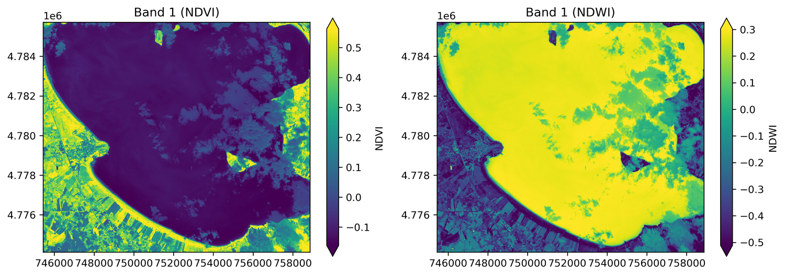

# Statement of need

Most Earth Observation data no longer arrives as a file on disk. Sentinel-2 and Landsat sit in cloud catalogs, indexed by STAC [@stac_spec] and stored as
cloud-optimized GeoTIFFs. A researcher asking about one place over one season has to query a catalog, pull a small window out of scenes whose cumulative size can go up to hundreds
of megabytes, and line up bands delivered at different resolutions before computing anything at all.

Python has good tools for each step. Rasterio [@rasterio] reads and writes over GDAL [@gdal], NumPy [@numpy] does the arithmetic, GeoPandas [@geopandas] handles the vector files. Joining them up is left to the analyst, and that is where the quiet failures happen. `nodata` has to be masked before a mean, or fill values land in the statistic. Integer bands have to be promoted before a subtraction to prevent overflow and underflow errors.

The usual way out is a hosted platform. Google Earth Engine [@gorelick2017] is the obvious one and it is very good at scale. But it needs an account, the work runs on someone else's servers, and the analysis has to be written in its deferred API. That is a poor fit for a study which has to run locally and still reproduce in three years.

Easy-EO covers the whole path. A search against any STAC catalog returns scenes; loading one fetches only the window over the area of interest, over HTTP; the masking and promotion rules apply unless you turn them off. For anything it does not cover, the rasterio dataset underneath is exposed directly, and the pixels can be accessed as a NumPy array or as a georeferenced xarray DataArray [@xarray].

# State of the field

rastereasy [@corpetti2025] is the nearest neighbour: a chainable image object over rasterio, aimed at the same non-specialist audience. It works on imagery the user already holds, and extends from there into filtering, dimensionality reduction and classifier fitting. Easy-EO extends in the other direction. A search against any STAC catalog returns matching scenes, and loading one pulls only the pixels under the area of interest across the network, so a study site can be analysed without the tile it sits in ever being downloaded entirely. Band names survive the round-trip to disk, and a band can be addressed as `"red"` anywhere an index is accepted. The `nodata` and dtype rules hold on every operation, whether or not the analyst thinks about them. Neither package is a superset of the other.

The rest of the field sits further off. rioxarray [@rioxarray] over xarray [@xarray] is the better tool when the work is genuinely multidimensional, a long time series or a chunked computation under Dask; Easy-EO hands off to it at the boundary. xarray-spatial [@xarray_spatial] adds algorithms to that model but leaves data access to the caller, and eo-learn [@eolearn] targets machine-learning pipelines through its heavier EOPatch abstraction. EarthPy [@earthpy] offers helper functions for stacking and plotting rasters, which stand alone: there is no dataset object to chain from, and data access is left to the user.

# Software design

A dataset in Easy-EO does not hold the pixels itself. It keeps a backend adapter, and the adapter is what holds them. Today there are two. One wraps a rasterio dataset opened from a file on disk. The other wraps a NumPy array already in memory.

A scene pulled from a catalog becomes the second kind. Easy-EO opens the remote file, takes only the window over the area of interest, and hands that window to the in-memory adapter, so nothing is written to disk and nothing further down needs to know where the pixels came from. Because every operation is written against the adapter instead of against one kind of storage, clipping a file and clipping an array run the same code. The price is a small extra step on each read. The advantage is that a new adapter, one that streams pixels in chunks as they are needed, could be added later without any of the operations being rewritten.

The operations themselves live outside the dataset class. Each is a free function carrying an `@eeo_raster_op` decorator. At import time Easy-EO walks the modules under `eeo.ops`, `eeo.analysis`, `eeo.preprocessing` and `eeo.viz`, binding every decorated function onto the dataset as a method. A user sees one object carrying the whole API, so a clip, a resample and an index chain together in a single expression. A maintainer sees small files grouped by topic, and contributing an operation means writing one decorated function, with no central class to edit.

Where a default could be safe or fast, Easy-EO takes the safe one. Pixels flagged as `nodata` are masked before any statistic, so fill values never reach a mean. Integer bands are promoted to floating point before arithmetic, so a `uint16` subtraction that should go negative cannot wrap round to 65,000. The spectral indices return `float32` and guard the denominator, yielding zero where it would divide by zero instead of raising or emitting `inf`. Reads stay deferred until an operation needs pixels, and statistics over a large raster come from a decimated read capped at 1024 pixels a side, served from the file's overviews when it has them. Band names follow the same reasoning. Operations that preserve band identity, such as clipping, resampling and reprojection, carry the names through; an index synthesizes a new band, so it labels its own output, because inheriting the input's name would mislabel the result.

# Example

Searching a catalog, cropping to an area of interest and computing two indices takes the following, and produces \autoref{fig:indices}.

```python
import eeo
from eeo.viz import plot_raster

bbox = (12.02, 43.08, 12.18, 43.18)   # Lake Trasimeno, Italy, WGS 84

scene = eeo.stac_search(
    "sentinel-2-l2a", bbox=bbox,
    datetime="2024-06-01/2024-09-30", cloud_cover=10, limit=1,
)[0].load(["B03", "B04", "B08"], bbox=bbox)

ndvi = scene.ndvi(red="B04", nir="B08", name="NDVI")
ndwi = scene.ndwi(green="B03", nir="B08", name="NDWI")

plot_raster([ndvi, ndwi], cmap="viridis", ncols=2, colorbar=True)
```

The load fetches only the 1160 by 1343 pixel window over the lake, out of a granule that is 10980 pixels square in each of these bands, and the three assets are read straight through that window without the full tile being downloaded. Both indices come back as `float32`.


